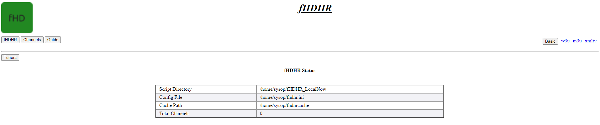
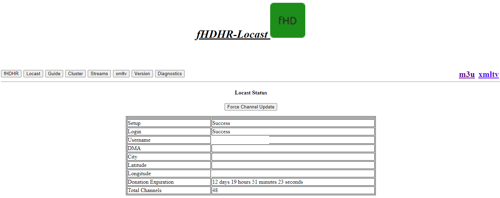
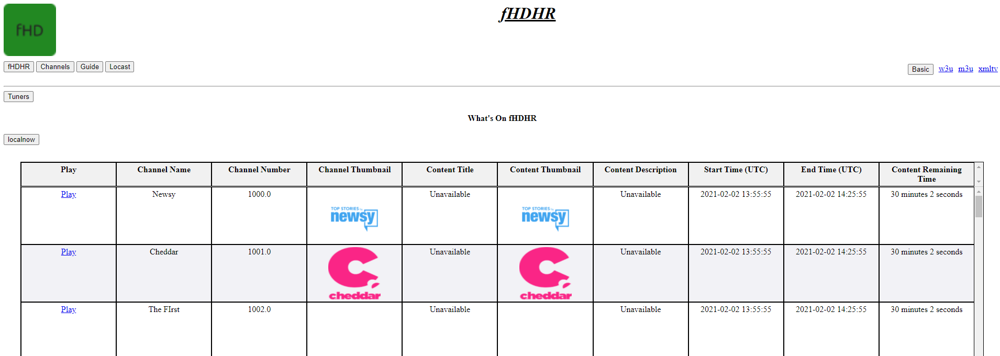
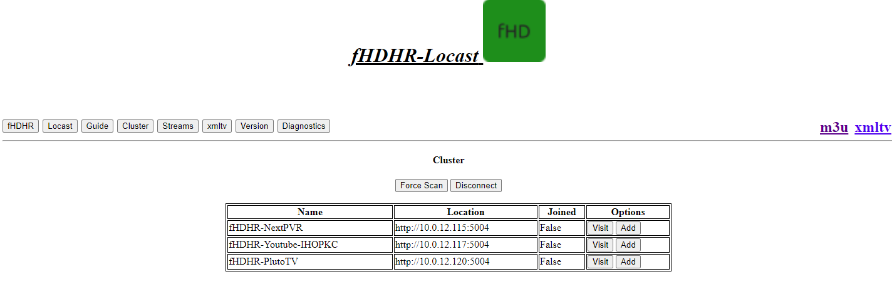
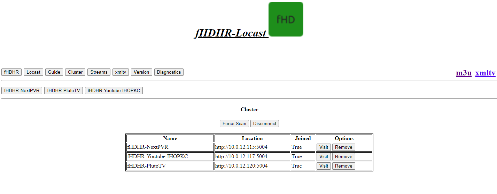
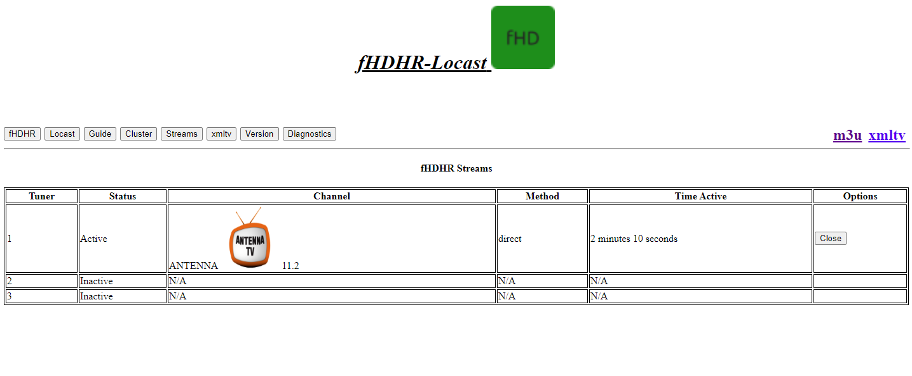
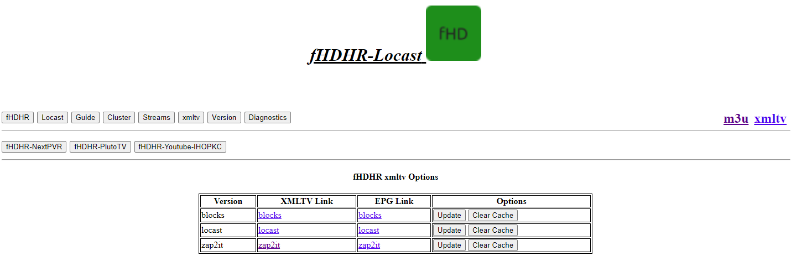
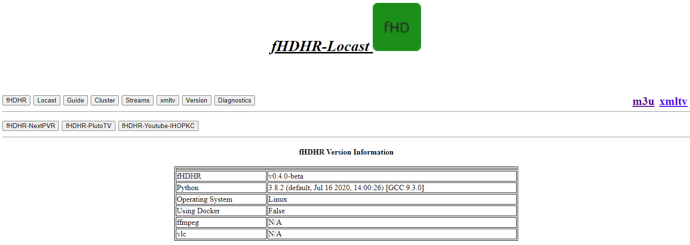
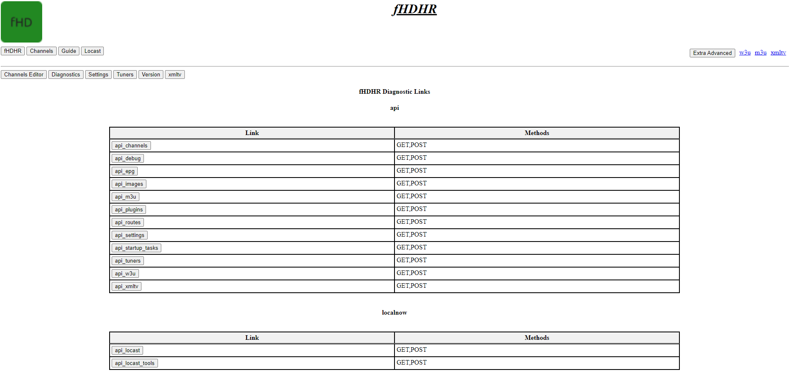

fHDHR    

---
[Main](README.md)  |  [Setup and Usage](Usage.md)  |  [Locast](Origin.md)  |  [Credits/Related Projects](Related-Projects.md)
---
**f**un
**H**ome
**D**istribution
**H**iatus
**R**ecreation

---

[Basic Configuration](Config.md)  | [Advanced Configuration](ADV_Config.md) |  [WebUI](WebUI.md)

---

This Page will introduce basic handling of the script from the Web Interface provided at IP:Port

The Pages are available in the buttons at the top, links to xmltv and m3u are provided at the top for ease of access.

# Main Landing Page

Below is the main landing page with basic information.

# Locast

Here you will have access to some basic information about the service we are proxying.

The webUI will still work, even if setup didn't go smoothly.

# Guide

This Page give you information about what is currently playing on all stations. It will also show the time remaining for each item.

* Note: The Play link in the left hand column can be copied to play a channel in VLC media player!

# Cluster

Since SSDP is used for service discovery, I decided to also use it for ease of management.

This tab will not have the below options if SSDP isn't running.

Joining a cluster will provide a second row of buttons for the clustered servers.

Unjoined:

Joined:

# Streams

This Page will show all active streams, and tuner information. You can also terminate a stream from here.

* Note: Clients will often have an amount buffered, and the connection termination is not immediate from a viewing perspective. However, the connection to the source is indeed cut off.

# xmltv

This page will give you access to all the xmltv formats provided by this varient.

From here, you can manually update or even clear the cached epg, and then update.

# Version

This page will give valuable information about the environment the script is being run in.

# Diganostics

This page has various links to json/xml files that make the magic work, as well as debug and cluster information.

