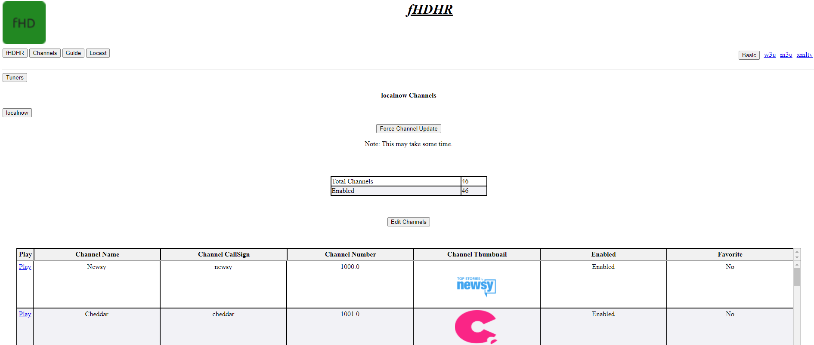
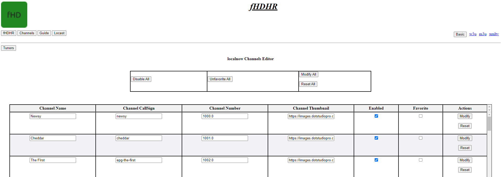
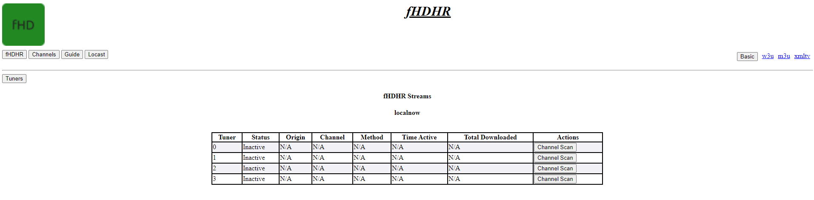

fHDHR    

---
[Main](README.md)  |  [Setup and Usage](Usage.md)  |  [Plugins](Plugins.md)  |  [Credits/Related Projects](Related-Projects.md)
---
**f**un
**H**ome
**D**istribution
**H**iatus
**R**ecreation

---

[Basic Configuration](Config.md)  | [Advanced Configuration](ADV_Config.md) |  [WebUI](WebUI.md)

---

This Page will introduce basic handling of the script from the Web Interface provided at IP:Port

The Pages are available in the buttons at the top, links to xmltv and m3u are provided at the top for ease of access.

# Main Landing Page

Below is the main landing page with basic information.

# Channels

This Page will display the channels you have per your origin plugin. It will also provide access to a Channel Editor.

* Note: The Play link in the left hand column can be copied to play a channel in VLC media player!

# Channel Editor

This Page will allow you to edit the channels you have per your origin plugin. From here, you can adjust the channel logo, the channel number, and the channel name.

# Guide

This Page give you information about what is currently playing on all stations. It will also show the time remaining for each item.

* Note: The Play link in the left hand column can be copied to play a channel in VLC media player! (If selected EPG is from Origin)

# Tuners

This Page will show all active tuner information. You can also terminate a stream from here.

* Note: Clients will often have an amount buffered, and the connection termination is not immediate from a viewing perspective. However, the connection to the source is indeed cut off.

# xmltv

This page will give you access to all the xmltv formats provided by this varient.

From here, you can manually update or even clear the cached epg, and then update.

# Version

This page will give valuable information about the environment the script is being run in.

# Diagnostics

This page has various links to json/xml files that make the magic work.

# Settings

This page allows viewing/changing all possible configuration options.

* Note: This will require a restart of the script to have any effect.

